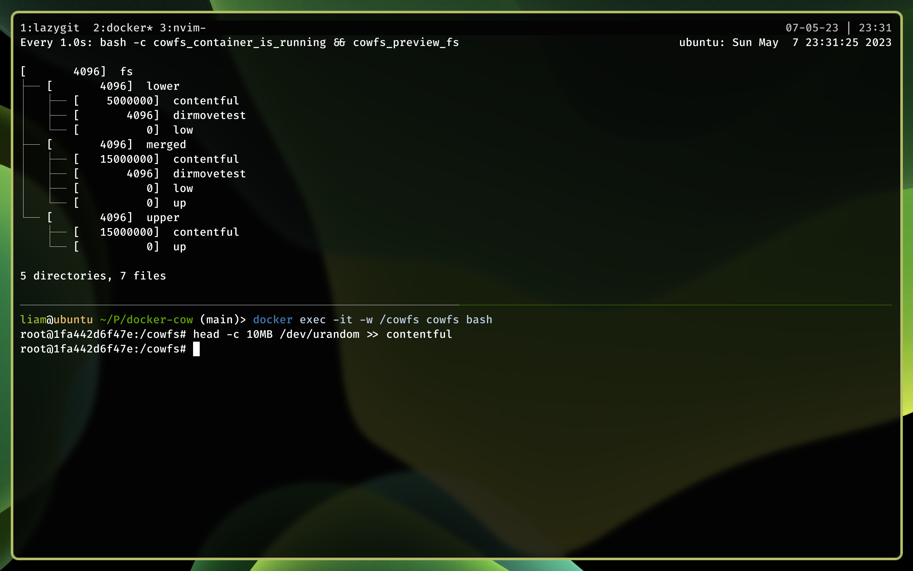

# Docker CoW

> "Docker - Copy on Write"

This is just intended as a quick and easy playground to test out the overlay
filesystem. See: https://docs.kernel.org/filesystems/overlayfs.html.

# Why is this useful?

In this case it's to test out how you might want to design a CoW filesystem in
docker.

For example you can see that creating a 10MB modification to the contentful file
that originated from our "read-only" lower layer performs a copy of the file,
appends the modification in the work directory and then stores the result in the
upper layer which is exposed to the container:


What I just said was a over abstraction (and a bit of a lie), please read: https://docs.kernel.org/filesystems/overlayfs.html to understand how this actually works.

In short this means you can mount a read-only filesystem to the container and
still transparently allow ephemeral writes. Think staging environment sharing
production's assets (hopefully with some level of data washing inbetween).

# Requirements
 - Docker
 - The overlay kernel module (often default)
 - Root or Linux CAPS to mount (hopefully not sysadmin since you're a security
   focused person, right?)
 - Tree(1) (optional - if you want a sane output, will fallback to find(1) if missing)

Check kernel modules requirements:
```bash
modprobe overlay || echo 'You need to do some setup!'
```

# Usage
To run:
```bash
./run.bash
```

To jump into the container:
```bash
docker exec -it -w /cowfs cowfs bash
```

Stop with `C-c`/`^C`/`Ctrl-c`/SIGINT or from any other terminal:
```bash
docker stop cowfs
```
Note that the mount will be torn down automatically for you.

To reset the filesystem (while stopped):
```bash
rm -rf ./fs
```

# Debugging

You should looking into linux's tracing utilities such as ftrace and debugfs.
